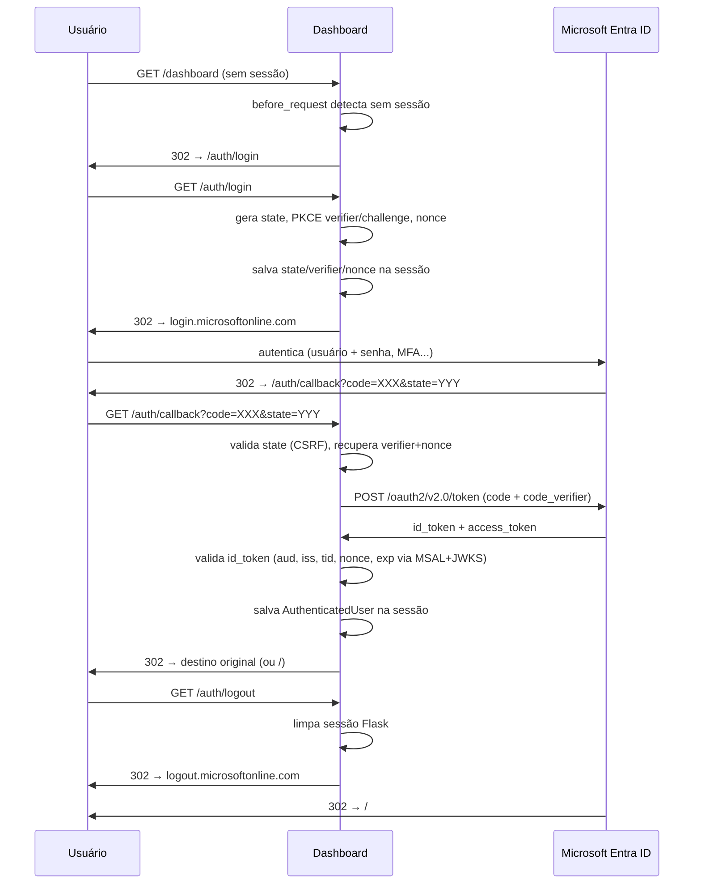

# Autenticação — Microsoft Entra ID SSO (Sprint 6)

## 1. Visão Geral

O dashboard usa **OAuth2 Authorization Code Flow com PKCE** via Microsoft Entra ID para autenticar usuários. Todas as rotas exceto `/health`, `/api/health` e `/auth/*` exigem sessão ativa.



## 2. Setup Local

### 2.1 App Registration no Azure Portal

1. Acesse [portal.azure.com](https://portal.azure.com) → **Microsoft Entra ID** → **App Registrations** → **New registration**
2. Preencha:
   - Name: `itgov-dashboard-dev`
   - Supported account types: *Accounts in this organizational directory only*
   - Redirect URI: `http://localhost:5000/auth/callback` (Web)
3. Clique em **Register**
4. Copie o **Application (client) ID** → `AZURE_CLIENT_ID`
5. Copie o **Directory (tenant) ID** → `AZURE_TENANT_ID`
6. Vá em **Certificates & secrets** → **New client secret** → copie o valor → `AZURE_CLIENT_SECRET`

### 2.2 Permissões necessárias

Em **API permissions** → **Add a permission** → **Microsoft Graph** → **Delegated**:
- `openid`, `profile`, `email` (selecionados automaticamente)
- `User.Read`

### 2.3 Variáveis de Ambiente

```bash
# .env
AZURE_TENANT_ID=<seu-tenant-id>
AZURE_CLIENT_ID=<seu-client-id>
AZURE_CLIENT_SECRET=<seu-client-secret>
AZURE_REDIRECT_URI=http://localhost:5000/auth/callback

# Flask-Session
SESSION_TYPE=filesystem
SESSION_FILE_DIR=./data/sessions
PERMANENT_SESSION_LIFETIME=3600

# Flask secret (assina cookies)
SECRET_KEY=$(python -c "import secrets; print(secrets.token_hex(32))")
```

### 2.4 Iniciar o Servidor

```bash
# Instalar dependências
pip install -r requirements.txt

# Criar diretório de sessões
mkdir -p ./data/sessions

# Subir o servidor
flask run --port 5000

# Testar fluxo completo
open http://localhost:5000/
```

## 3. Variáveis de Ambiente

| Variável | Obrigatória | Padrão | Descrição |
|---|---|---|---|
| `AZURE_TENANT_ID` | Sim (SSO) | — | Directory ID do Entra ID |
| `AZURE_CLIENT_ID` | Sim (SSO) | — | Application ID do App Registration |
| `AZURE_CLIENT_SECRET` | Sim (SSO) | — | Client Secret (girar a cada 12-24 meses) |
| `AZURE_REDIRECT_URI` | Não | `http://localhost:5000/auth/callback` | URI de callback registrada no portal |
| `SESSION_TYPE` | Não | `filesystem` | Backend de sessão (`filesystem` dev, `redis` prod) |
| `SESSION_FILE_DIR` | Não | `./data/sessions` | Diretório para sessões filesystem |
| `PERMANENT_SESSION_LIFETIME` | Não | `3600` | Duração da sessão em segundos |

> **SSO é opcional por design.** Se `AZURE_TENANT_ID`, `AZURE_CLIENT_ID` ou `AZURE_CLIENT_SECRET` não estiverem definidos, `AZURE_SSO_ENABLED=False` e o dashboard roda sem autenticação (para dev local sem credenciais).

## 4. Criar / Rotacionar o Client Secret

1. Portal Azure → **App Registrations** → selecionar o app
2. **Certificates & secrets** → **New client secret**
3. Defina expiração: 12 meses (recomendado) ou 24 meses
4. Copie o **Value** imediatamente (não fica visível depois)
5. Atualize `.env` com o novo `AZURE_CLIENT_SECRET`
6. Reinicie o servidor
7. Delete o secret antigo após confirmar que o novo funciona

## 5. Endpoints de Auth

| Endpoint | Método | Autenticação | Descrição |
|---|---|---|---|
| `/auth/login` | GET | Pública | Inicia fluxo OAuth2 |
| `/auth/callback` | GET | Pública | Recebe code da Microsoft, troca por token |
| `/auth/logout` | GET | Pública | Limpa sessão + redireciona para logout MS |
| `/auth/me` | GET | Requer sessão | Retorna dados do usuário autenticado |
| `/auth/login-failed` | GET | Pública | Página de erro de autenticação |

### Resposta de `/auth/me`

```json
{
  "oid": "abc123-...",
  "email": "alice@contoso.com",
  "name": "Alice Smith",
  "tenant_id": "tenant-id",
  "preferred_username": "alice@contoso.com"
}
```

## 6. Troubleshooting

### AADSTS50011 — Redirect URI mismatch

```
AADSTS50011: The redirect URI 'http://localhost:5000/auth/callback'
specified in the request does not match the redirect URIs configured
for the application.
```

**Causa:** `AZURE_REDIRECT_URI` não está registrado no App Registration.

**Solução:** Portal Azure → App Registration → Authentication → adicionar `http://localhost:5000/auth/callback` em **Web > Redirect URIs**.

---

### AADSTS65001 — Consent required

```
AADSTS65001: The user or administrator has not consented to use the
application with ID...
```

**Causa:** As permissões do app não foram aprovadas pelo admin do tenant.

**Solução:** Portal Azure → App Registration → API permissions → **Grant admin consent for <tenant>**.

---

### AADSTS700016 — App not found in tenant

```
AADSTS700016: Application with identifier '...' was not found in the
directory '...'.
```

**Causa:** `AZURE_CLIENT_ID` está errado, ou o app está registrado em outro tenant.

**Solução:** Verificar `AZURE_TENANT_ID` e `AZURE_CLIENT_ID` no `.env`. Confirmar que o App Registration está no tenant correto.

---

### State mismatch

```json
{"error": "Authentication failed", "reason": "state_mismatch"}
```

**Causa:** O parâmetro `state` retornado pela Microsoft não bate com o salvo na sessão. Acontece se:
- A sessão expirou antes do callback
- O usuário abriu múltiplas abas de login
- A sessão foi invalidada

**Solução:** Tentar fazer login novamente a partir do início.

---

### id_token validation failed

```json
{"error": "Authentication failed", "reason": "token_invalid"}
```

**Causa:** O `id_token` falhou em uma das validações: `aud`, `iss`, `tid`, `nonce`, ou `exp`.

**Diagnóstico:** Verificar logs estruturados:
```bash
grep "auth.callback.token_validation_failed" logs/app.log
```

---

### Sessão expira imediatamente

**Causa:** `SESSION_FILE_DIR` não existe ou não tem permissão de escrita.

**Solução:**
```bash
mkdir -p ./data/sessions
chmod 700 ./data/sessions
```

## 7. Migração Filesystem → Redis (Produção)

```bash
# 1. Adicionar Redis ao docker-compose.yml
# redis:
#   image: redis:7-alpine
#   restart: unless-stopped

# 2. Instalar dependências
pip install flask-session[redis] redis

# 3. Atualizar .env
SESSION_TYPE=redis
# SESSION_REDIS=redis://localhost:6379/0  (opcional, padrão: localhost:6379/0)

# 4. Reiniciar
docker-compose up -d
```

> **Nota:** A migração invalida sessões existentes. Usuários precisarão fazer login novamente.

## 8. Segurança

- **PKCE (S256):** Previne code interception attacks em ambientes públicos
- **State parameter:** Proteção CSRF — token aleatório de 32 bytes gerado por `secrets.token_urlsafe`
- **Nonce:** Anti-replay para o `id_token`
- **MSAL JWKS validation:** MSAL valida assinatura do `id_token` contra as chaves públicas da Microsoft
- **Claims extras validados:** `aud`, `iss`, `tid`, `nonce` verificados manualmente após MSAL
- **Cookie flags:** `HttpOnly=True`, `SameSite=Lax`, `Secure=True` (em produção com HTTPS)
- **Secrets em `SecretStr`:** `AZURE_CLIENT_SECRET` nunca aparece em logs via Pydantic `SecretStr`
- **Audit log:** Todos os eventos de auth logados com structlog (`auth.login.success`, `auth.login.failed`, `auth.logout`)
